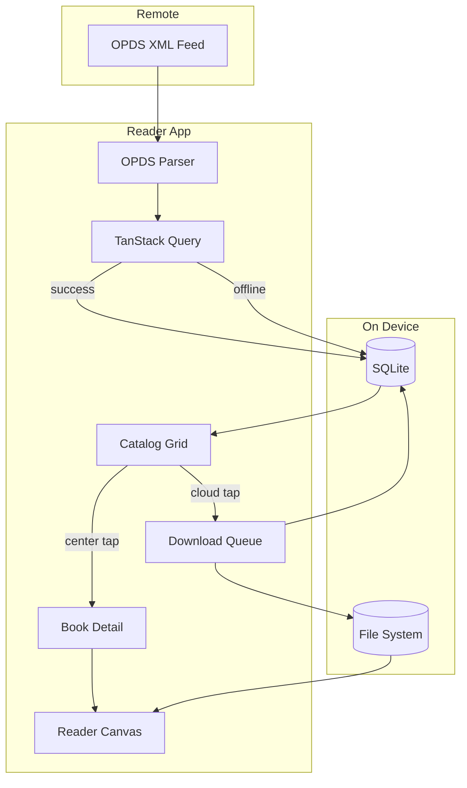

<p align="center">
  
</p>

<h1 align="center">Verso</h1>

<p align="center">
  <strong>A premium, local-first, OPDS-first e-book reader for iOS & Android.</strong><br />
  Built with Expo SDK 57 · React Native · TypeScript · SQLite
</p>

<p align="center">
  <a href="https://github.com/AlejandroAkbal/Verso/blob/main/LICENSE">
    
  </a>
  <a href="https://docs.expo.dev/versions/v57.0.0/">
    
  </a>
  <a href="https://reactnative.dev/">
    
  </a>
  <a href="https://www.typescriptlang.org/">
    
  </a>
  <a href="https://pnpm.io/">
    
  </a>
</p>

<p align="center">
  <a href="#features">Features</a> ·
  <a href="#screenshots">Screenshots</a> ·
  <a href="#architecture">Architecture</a> ·
  <a href="#getting-started">Getting Started</a> ·
  <a href="#project-structure">Structure</a> ·
  <a href="#contributing">Contributing</a>
</p>

---

## Overview

**OPDS Reader** is an open-source mobile e-book reader that treats your library as yours: catalogs are cached locally, downloads survive backgrounding, and network failures degrade gracefully instead of leaving you with an empty screen.

Connect any [OPDS](https://opds.io/) feed, browse a dense cover grid, download books with a single tap, and read offline with a native-feeling paginated canvas — all wrapped in a pitch-black, distraction-free interface.

> **Status:** Early development. APIs and UX may change. Issues and PRs welcome.

---

## Features

| | |
|---|---|
| **OPDS-first catalog** | Fetch, parse, and normalize Atom/XML feeds from configurable servers |
| **Local-first cache** | Every catalog snapshot persists to SQLite for instant offline replay |
| **Dual-tap grid** | Center tap opens detail · cloud icon triggers silent background download |
| **Non-blocking queue** | Resumable downloads with live progress rings; multiple items in parallel |
| **Premium detail view** | Dominant-color extraction + `expo-blur` dynamic backdrop behind metadata |
| **Offline reader** | EPUB & plain-text pagination with persisted position and font controls |
| **Pure dark mode** | Strict design tokens — pitch black `#000`, no compromise |

### Built with

- [**Expo Router**](https://docs.expo.dev/router/introduction/) — file-based navigation (`src/app/`)
- [**Expo SQLite**](https://docs.expo.dev/versions/v57.0.0/sdk/sqlite/) — persistent metadata & download registry
- [**TanStack Query**](https://tanstack.com/query) — remote feed fetching with cache fallback
- [**fast-xml-parser**](https://github.com/NaturalIntelligence/fast-xml-parser) — lightweight OPDS XML normalization
- [**FlashList**](https://shopify.github.io/flash-list/) — buttery catalog scrolling at scale
- [**expo-background-task**](https://docs.expo.dev/versions/v57.0.0/sdk/background-task/) — download queue survives suspension

---

## Screenshots

<!-- Replace with real captures when available -->
| Catalog | Book Detail | Reader |
|:---:|:---:|:---:|
| *Coming soon* | *Coming soon* | *Coming soon* |

---

## Architecture



**Offline resiliency:** when TanStack Query fails, the UI reads the last SQLite snapshot and shows a subtle *Offline Mode* banner — never a blank catalog.

---

## Getting Started

### Prerequisites

- [Node.js](https://nodejs.org/) 22+
- [pnpm](https://pnpm.io/) 9+
- [Expo CLI](https://docs.expo.dev/more/expo-cli/) (via `pnpm expo`)
- **Development build required** — Expo Go is not supported (SDK 57 + native modules). Use `pnpm run:ios` or EAS.

### Install & run (iOS simulator)

```bash
git clone https://github.com/AlejandroAkbal/Verso.git
cd Verso
pnpm install
pnpm run:ios          # builds dev client + opens iPhone simulator
```

Metro-only (if you already built the native app):

```bash
pnpm start            # dev client connects to Metro
```

### Physical device

Expo Go is **not supported**. Build a dev client:

```bash
eas build --profile development --platform ios
pnpm start
```

Scan the QR code with the **dev client app**, not Expo Go.

### CocoaPods troubleshooting

If `pod install` fails with `cdn.cocoapods.org` SSL errors:

```bash
pnpm pod-install
```

### First launch

The app opens a short onboarding flow — welcome screen, then connect your OPDS catalog (Calibre-Web, etc.). Credentials are stored on-device only (`expo-secure-store` for passwords).

Display name and bundle IDs are defined in `src/config/appIdentity.ts` (currently **Reader** / `dev.akbal.opdsreader`).

For local dev prefills, copy `src/config/dev-secrets.example.ts` → `src/config/dev-secrets.ts` (gitignored).

Add, edit, or remove servers anytime from **Settings**.

---

## Project Structure

```text
src/
├── app/                  # Expo Router screens
│   ├── (tabs)/           # Library home screen
│   ├── book/[id].tsx     # Detail view (dynamic blur)
│   ├── reader/[id].tsx   # EPUB / text reader
│   └── settings.tsx      # OPDS server management
├── components/           # BookCard, ProgressRing, BlurBackdrop, …
├── db/                   # SQLite schema, migrations, queries, hooks
├── hooks/                # useOPDSCatalog, useBackgroundDownload, …
├── services/
│   ├── opds/             # XML parser engine
│   ├── downloads/        # Queue + background task
│   └── reader/           # EPUB extraction & pagination
└── theme/                # Pitch-black design system
```

---

## Scripts

| Command | Description |
|---|---|
| `pnpm start` | Start Expo dev server |
| `pnpm ios` | Open iOS simulator |
| `pnpm android` | Open Android emulator |
| `pnpm lint` | Run ESLint via Expo |
| `pnpm exec tsc --noEmit` | Type-check |

---

## Learning Resources

Want to understand the SQLite patterns this app builds on? Check out the standalone companion example (not part of this repo):

**[Expo-With-SQLite-Example](https://github.com/expo/examples/tree/master/with-sqlite)** — official Expo todo demo with `SQLiteProvider`, `PRAGMA user_version` migrations, and `withExclusiveTransactionAsync`.

---

## Contributing

Contributions are welcome! Whether it's a bug report, OPDS compatibility fix, reader improvement, or documentation polish:

1. **Fork** the repository
2. **Create** a feature branch (`git checkout -b feat/amazing-thing`)
3. **Commit** your changes with a clear message
4. **Open** a Pull Request

Please keep PRs focused and match the existing TypeScript strictness — no `any`, functional components only.

---

## License

[AGPL-3.0](./LICENSE) © [Alejandro Akbal](https://github.com/AlejandroAkbal)

---

<p align="center">
  <sub>Built with care for readers who want their books on their device, on their terms.</sub>
</p>
